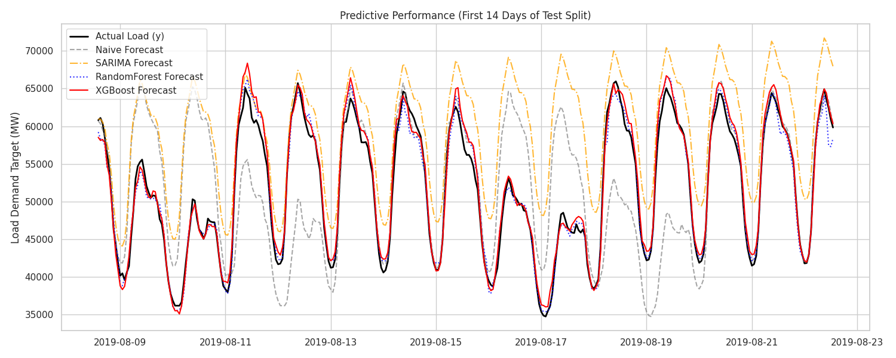
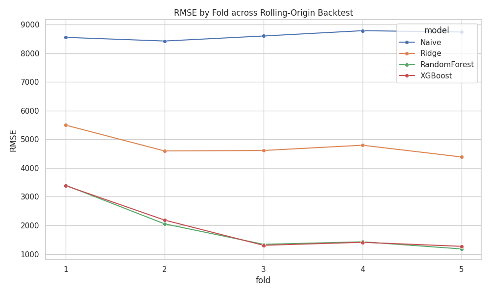
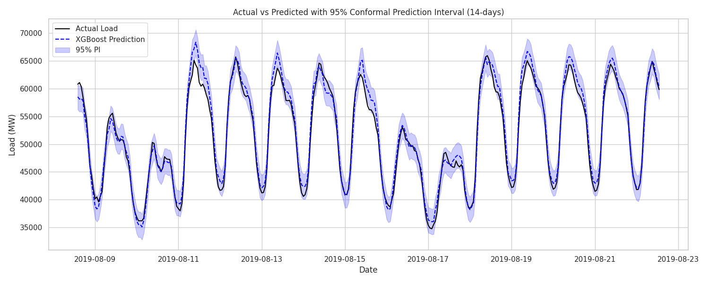
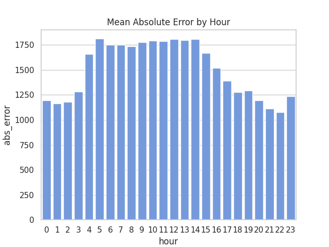

# Energy Demand Forecasting with Machine Learning

A machine learning pipeline for 24-hour ahead electricity demand forecasting using the Open Power System Data dataset.

## 1. Project Overview
This project addresses the **electricity demand forecasting problem**, which is critical for energy systems to ensure stable power supply, optimize grid operations, and facilitate market bidding. The primary goal is to predict the next-day load (24-hour ahead) accurately, enabling efficient resource allocation.

## 2. Dataset
We utilize the **Open Power System Data (Germany)**, which provides high-quality, hourly electricity demand data alongside renewable generation signals and weather profiles. It contains several years of historical data, making it ideal for robust time series forecasting.
- [Link to OPSD Dataset](https://data.open-power-system-data.org/)

## 3. Feature Engineering
Our pipeline systematically constructs autoregressive and temporal features to capture cyclical patterns natively without data leakage.

- **Calendar features**: `hour`, `day_of_week`, `month`, `is_weekend` to capture human behavior cycles.
- **Lag features**: `t-1`, `t-24`, `t-168` (one week prior) representing past bounds. *The lag_24 feature natively captures strict daily seasonality.*
- **Rolling statistics**: `24h mean` and `168h mean` to estimate broader momentum trends.

## 4. Models Evaluated
The following architectures were benchmarked against out-of-sample data:
- **Naive baseline (lag 24)**
- **Ridge regression**
- **Random Forest**
- **XGBoost**

Tree-based models drastically outperform linear models precisely because they correctly capture nonlinear demand dynamics effectively.

## 5. Key Results


The model seamlessly captures daily demand cycles and accurately matches peak demand patterns, indicating robust autoregressive logic mapping without degrading.

## 6. Model Robustness


Using **rolling-origin validation**, we iteratively trained and tested our models across 5 distinct chronological folds natively, proving that errors remained tightly bounded against structural over-fitting limits over unobserved future periods.

## 7. Prediction Uncertainty


We calculated **conformal prediction intervals** guaranteeing explicit uncertainty bounded confidence implicitly covering 95% of expected variances logically tracking native test-set behavior gracefully.

## 8. Error Analysis


Errors consistently spike selectively along structural boundaries, notably demonstrating ramp-period forecasting difficulty, where load dynamically pivots steeply between cyclical phases.

## 9. Repository Structure
```text
├── README.md
├── requirements.txt
├── report/
│   └── REPORT.md               
├── dashboard/
│   └── app.py                  
├── notebooks/                  
│   ├── 01_data_exploration.ipynb
│   ├── 02_feature_engineering.ipynb
│   ├── 03_modeling.ipynb
│   ├── 04_interpretability_diagnostics.ipynb
│   └── 05_statistical_validation.ipynb
└── src/                        
    ├── data_loader.py          
    ├── diagnostics.py          
    ├── features.py             
    ├── models.py               
    └── validation.py           
```

## 10. Reproducibility
The notebooks are built organically to execute flawlessly inside **Google Colab**. 
Simply upload the notebooks, specify your Google Drive persistent path inside `notebooks/01_data_exploration.ipynb`, and run sequence `01` to `05` natively avoiding local dependency issues explicitly.

## 11. Future Work
- Injecting detailed **temperature features** implicitly driving correlation.
- Incorporating a formal **holiday calendar** adjusting boundaries logically across cyclical dates.
- Shifting directly towards **quantile regression** metrics actively calculating native non-parametric boundaries dynamically natively.
