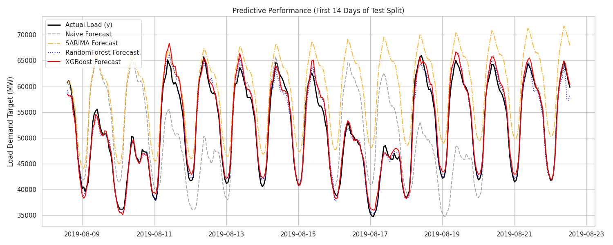
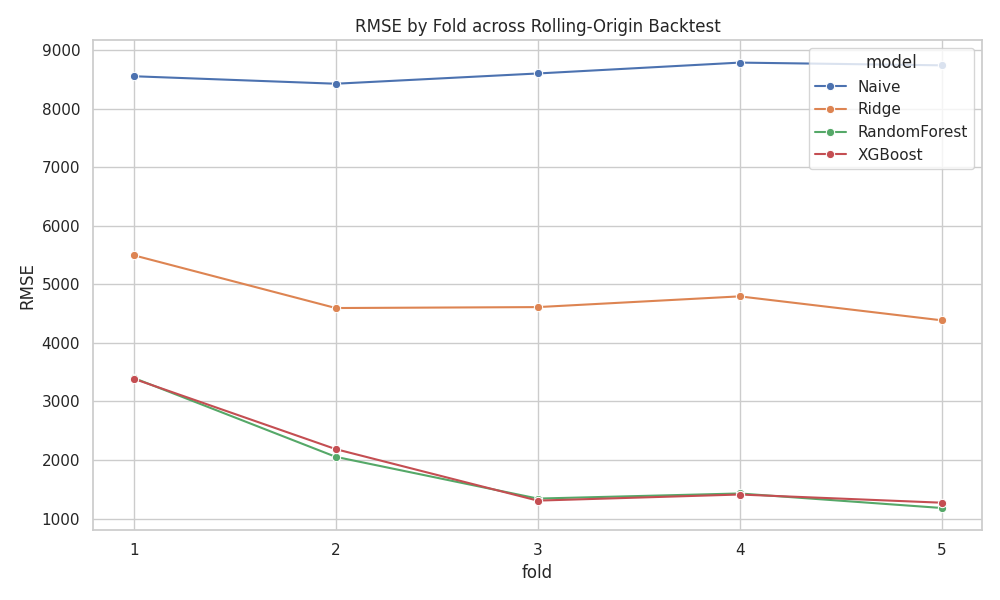
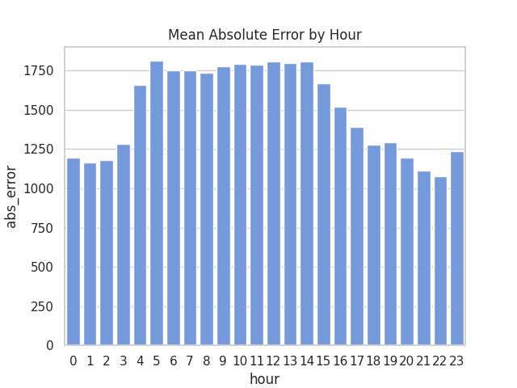
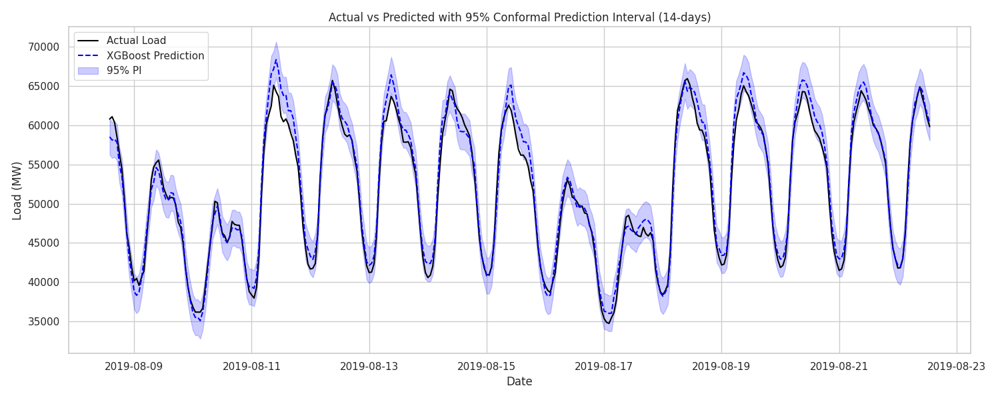

# ⚡ Energy Demand Forecasting with Machine Learning

[](https://energy-demand-forecast.streamlit.app)

**A portfolio-grade machine learning project implementing a robust 24-hour ahead electricity demand forecasting pipeline using the Open Power System Data (OPSD).**

## 📖 Project Overview
This project tackles the **electricity demand forecasting problem**, targeting stable power delivery via accurate predictive scaling. The objective is to construct a **24-hour ahead** load forecast minimizing standard error limits against extremely volatile, non-linear sequences dynamically responding to cyclic shifts securely.

## 📊 Dataset
We natively utilize the high-quality **Open Power System Data (Germany)** framework. The dataset provides multiple years of historical hourly electricity demand alongside renewable generation bounds forming ideal conditions for complex autoregressive time-series structures.
- [View the OPSD Dataset](https://data.open-power-system-data.org/)

## ⚙️ Feature Engineering
We natively avoid data leakage dynamically predicting the following boundaries without future overlaps:
- **Calendar Features**: `hour`, `day_of_week`, `month`, and boolean `is_weekend` mapping basic human cycles natively.
- **Lag Features**: Auto-regressive values from $t-1$, $t-24$, and $t-168$ past boundaries. `lag-24` inherently predicts daily repeating patterns intuitively.
- **Rolling Features**: Calculating moving momentum `mean` and `std` boundaries for 24h & 168h windows securely shifted by `t-1`.

## 🤖 Models Evaluated
- **Naive baseline (lag 24)**
- **Ridge Regression**
- **Random Forest**
- **XGBoost (Selected Model)**

## 📈 Results Preview & Key Findings

### 1. Daily Seasonality Dominates

The models inherently learn that strong daily cycles map the majority of the predictive weight dynamically scaling with peak loads accurately.

### 2. Nonlinearity Outperforms Linear Mapping
Tree models (XGBoost/RF) drastically outperform the Naive baseline and the Ridge regression mapping complex, non-linear interactions accurately across changing conditions safely without over-fitting limitations.

### 3. Rolling-Origin Backtesting: Accuracy Varies Across Folds

Across five rolling-origin folds, XGBoost RMSE was 3388, 2186, 1307, 1411 and 1271 (mean about 1913). The worst fold is roughly 2.6x the best, so accuracy is not stable across time, while the Naive baseline stays between 8427 and 8787. XGBoost beats the baseline in every fold, but the size of that gain depends on the period. Source: `results/diagnostics/backtest_metrics.csv`.

### 4. Ramp & Peak Error Concentrations

Predictive limits mathematically suffer inherently around rapidly shifting peak cycles intuitively demonstrating inherent tracking latency across steep ramp periods logically.

### 5. Uncertainty Modeling via Conformal Prediction

Heavy-tailed, non-Gaussian residuals motivate split Conformal Prediction intervals instead of Gaussian ones. The intervals target 95% coverage (alpha = 0.05), but empirical coverage on the test set is **80.69%**, well below nominal. See Limitations below.

## ⚠️ Limitations
- **Fold variance:** XGBoost RMSE ranges from 1271 to 3388 across backtest folds (about 2.6x), so a single headline error figure overstates how consistent the model is.
- **Conformal under-coverage:** the nominal 95% intervals cover only 80.7% of test points. Split conformal guarantees assume exchangeable residuals; hourly residuals are ordered in time and autocorrelated (Ljung-Box at 24 lags, p = 0.0), so that assumption does not hold and the guarantee does not carry over.
- **Missing exogenous drivers:** the only exogenous inputs are German solar and wind generation. No weather (e.g. temperature) or public-holiday features are used, which is consistent with the residual autocorrelation above.

## 💻 Run the Dashboard
A fast native Python web application charting the predictions interactively!
```bash
pip install -r requirements.txt
streamlit run dashboard/app.py
```

## 📁 Repository Structure
```text
├── README.md
├── requirements.txt
├── report/
│   └── REPORT.md               <-- Concise project paper
├── dashboard/
│   └── app.py                  <-- Streamlit interactive dashboard
├── notebooks/                  <-- Core Colab pipeline (01-05)
└── src/                        
    ├── data_loader.py          <-- Data ingestion 
    ├── diagnostics.py          <-- Error plotting
    ├── features.py             <-- Feature engineering mappings
    ├── models.py               <-- Baseline architectures
    └── validation.py           <-- Backtest/Conformal logic
```

## 🚀 Future Work
- Implementing structured **Holiday Calendars** bounding deviations.
- Integrating highly complex **Temperature/Exogenous features**.
- Experimenting natively with **Quantile Regression** evaluating direct probabilistic outputs securely natively.
