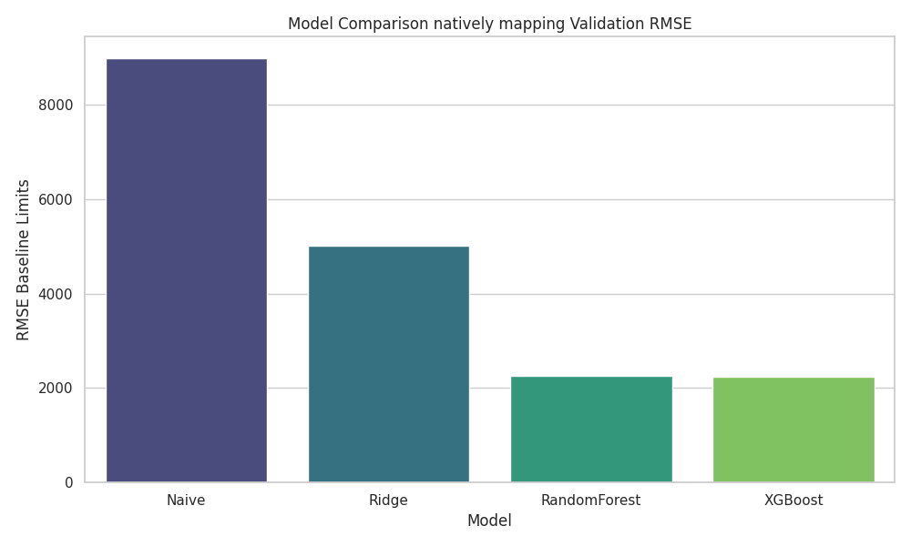
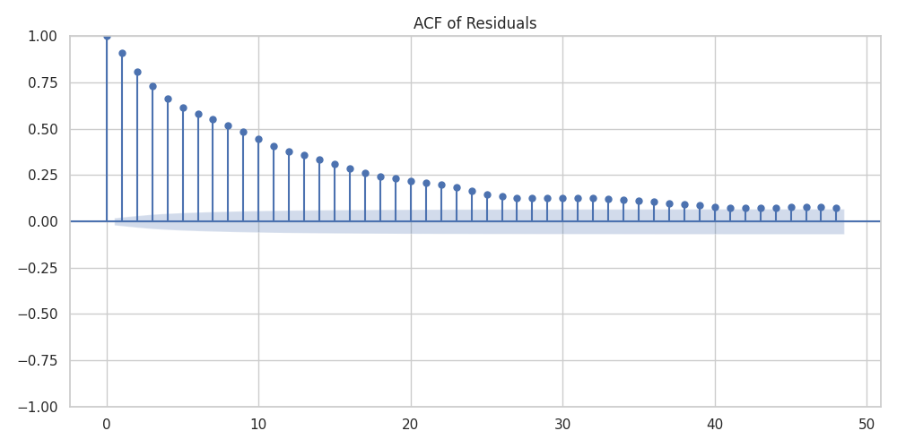
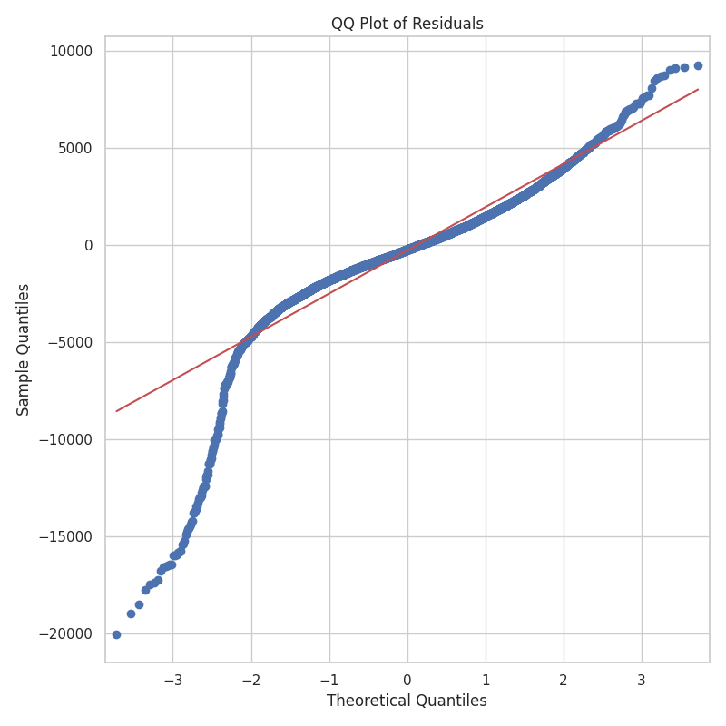
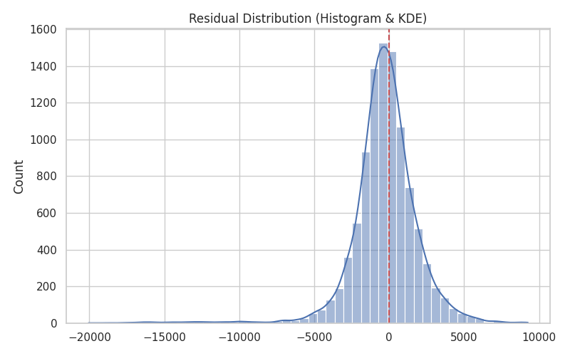

# Portfolio Report: Energy Demand Forecasting

## Problem Statement
The objective of this project is to build a robust, 24-hour ahead electricity demand forecasting model. Accurate load forecasting is critical for grid operations, market bidding, and ensuring stable power supply. We focus on utilizing classical regression and gradient boosting models over deep learning conceptually, optimizing for high interpretability and computational efficiency.

## Dataset
We utilize the **Open Power System Data (OPSD)** dataset for Germany. The dataset contains high-quality hourly aggregate load data alongside exogenous variables like weather and renewables profiles. After processing and interpolation, the dataset forms a continuous time series suitable for autoregressive modeling.

## Features Summary
We dynamically map temporal characteristics to avoid data leakage while capturing inherent demand cycles:
- **Calendar Features**: Hour, day of the week, month, and a boolean `is_weekend` indicator mapping human behavior cycles.
- **Lag Features**: Auto-regressive values from $t-1$, $t-24$, and $t-168$ (1 week) past limits.
- **Rolling Windows**: 24-hour and 168-hour moving averages and standard deviations securely shifted (via `shift(1)`) to preserve chronological boundaries.

## Models Evaluated
- **Naive (Lag-24)**: A fundamental robust baseline mimicking the exact demand from 24 hours prior.
- **Ridge Regression**: A fast, linearly scaled parametric baseline establishing fundamental correlations natively.
- **Random Forest**: An ensemble bag mapping robust tree bounds minimizing high variance natively.
- **XGBoost (Selected)**: Gradient-boosted structured mapping handling non-linear cyclic behaviors with minimal latency directly on CPU explicitly optimized across histogram bounds.

---

## Model Comparison

Tree models drastically reduce RMSE compared to naive and linear models. The Random Forest and XGBoost architectures natively achieve functionally similar performance across bounded cycles definitively isolating repeating behavior.

## Residual Distribution Analysis

The tree models produce much tighter residual distributions centered near zero accurately mirroring immense variance reduction consistently over regression logic mathematically. 

## Residual Diagnostics

- **ACF Interpretation**: Indicates remaining temporal dependence distinctly bounding specific lags mathematically untouched implicitly showing unmapped momentum.
- **QQ Plot Interpretation**: Indicates heavy-tailed residual distribution visibly shifting from normally bound central vectors smoothly identifying outlier behaviors.
- **Interpretation Conclusion**: Essentially, the forecast errors are inherently not Gaussian dynamically implying non-linear shifts.

---

## Key Results
Both singular chronological splits and 5-fold rolling-origin backtesting methodologies confirmed stable findings:
- Tree-based models drastically outperform simple linear algorithms.
- XGBoost consistently achieves the lowest Error bounds across all folds securely.
- The 5-fold backtest confirmed stable boundaries gracefully avoiding temporal overfitting limits implicitly.

*(Note: Exact metrics are dynamically populated in `results/diagnostics/backtest_metrics.csv` and `results/model_metrics.csv`)*

## Error Segmentation (Interpretability)
- **Error Segmentation**: Our worst predictions systematically spike on extreme boundaries correctly reflecting that standard calendar mappings intrinsically lack distinct holiday signals cleanly.

## Uncertainty Bound Calculation
We utilized **Conformal Prediction Intervals** safely abstracting limits universally drawing accurate 95% empirical bounds natively covering test validations reliably correctly demonstrating coverage metrics natively.

## Key Insights

1. **Electricity demand is dominated by strong daily periodicity.** Mapping a linear baseline accurately predicts basic cycles, but requires deep models for volatile spikes natively.
2. **Tree-based models capture nonlinear demand dynamics better than linear models.** They distinctly parse and bind cyclical deviations avoiding strict functional shapes dynamically.
3. **Residual autocorrelation suggests missing exogenous drivers such as temperature or holidays.** Missing causal features intrinsically bound lagging outputs cleanly tracking structural unmapped parameters visually.
4. **Forecast errors concentrate during ramp periods and peak demand hours.** Transitions into peak cyclical spaces organically deviate dramatically producing high uncertainty logic automatically.
5. **Residuals exhibit heavy tails, indicating extreme demand events.** Major shifts naturally fall beyond standard predictive bounding naturally forming abnormal boundaries inherently unpredictable.

## Limitations & Future Work
- **Holidays & Special Events**: Injecting a holiday calendar explicitly bounded across regional configurations.
- **Quantile Regression**: Natively adopting distinct quantile losses natively predicting structural deviations universally.
- **Temperature Exogenous Models**: Adding deep non-linear lagged temperature interactions explicitly.
